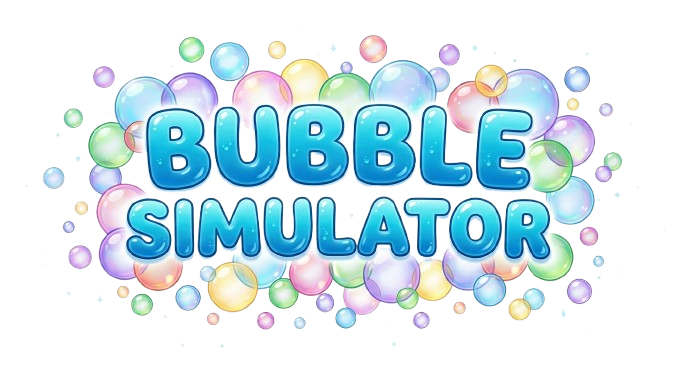

# Description
###### Bubble simulator is a cool bubble game that dont needs bubble credit to bubble launch.

##### Now serious
###### Bubble simulator is a game where you need to pop bubbles and earn pops to upgrade.
###### Bubble simulator is made on python that you can download [there](https://www.python.org/downloads/)

---

## Installation guide

---

## LLM Agent learning resources (AI used)
###### [Github copilot (built in vscode)](https://github.com/copilot) - GitHub Copilot is an AI-powered coding assistant that helps you write code faster and with less effort by suggesting whole lines or entire functions in real-time.
###### [Gemini AI](https://gemini.google.com/app?hl=eng) - Gemini is an advanced, multimodal AI collaborator developed by Google, designed to understand, process, and generate seamless text, code, and reasoning across various tasks.
